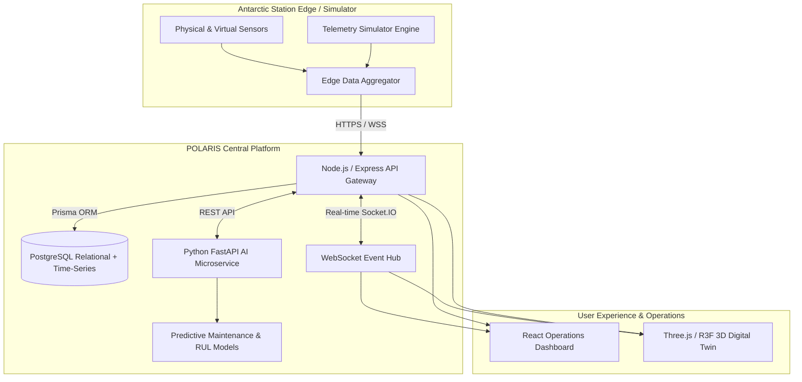

# POLARIS ❄️
### Polar Operations & Logistics Automated Remote Intelligence System

> **"A Digital Twin for Smarter Antarctic Station Management."**

[](https://ncpor.res.in/)
[](#phased-development-roadmap)
[](./LICENSE)
[](https://polaris-twin.vercel.app)
[](https://polaris-backend.onrender.com)

---

## 🧭 Project Overview

POLARIS is a full-stack digital twin platform for remotely managing India's Antarctic research stations. It provides real-time telemetry monitoring, AI-driven predictive maintenance, logistics management, and environmental intelligence for polar operations.

* **Title**: Digital Platform for efficient remote management of Indian Antarctic Research Stations
* **Organization**: Ministry of Earth Sciences (MoES)
* **Department**: National Centre for Polar and Ocean Research (NCPOR)
* **Category**: Software
* **Theme**: Smart Automation

---

## ❄️ Target Research Stations

POLARIS centralizes monitoring and automated intelligence for India's two permanent Antarctic research outposts:

| Station | Location | Coordinates | Commissioned | Primary Focus |
| :--- | :--- | :--- | :---: | :--- |
| **Bharati** | Larsemann Hills, East Antarctica | 69°24′26″ S, 76°11′14″ E | 2012 | Energy-efficient modern base, oceanography, polar biology, satellite telemetry |
| **Maitri** | Schirmacher Oasis, Queen Maud Land | 70°45′58″ S, 11°44′09″ E | 1989 | Inland base, meteorology, atmospheric science, geomagnetism, glaciology |

---

## 🏛️ System Architecture

POLARIS operates as a modular, resilient microservices platform designed to withstand intermittent satellite links while providing high-fidelity digital twin monitoring:



---

## 🛠️ Technology Stack

| Layer | Technologies |
| :--- | :--- |
| **Frontend UI** | React 18, Vite, TypeScript, Tailwind CSS, Lucide React, TanStack Query, Axios, Recharts |
| **3D Digital Twin** | Three.js, React Three Fiber (R3F), @react-three/drei, WebGL |
| **Backend Gateway** | Node.js, Express, TypeScript, Zod Schema Validation, Helmet, Morgan |
| **Real-Time Stream** | Socket.IO, WebSockets, Channel Rooms, Reconnection Backoff |
| **Database** | PostgreSQL 16, Prisma ORM, B-Tree & BRIN Indexes, Range Partitioning |
| **AI / ML Service** | Python 3.11+, FastAPI, Uvicorn, Scikit-Learn, Pandas, NumPy |
| **DevOps & Infra** | Docker, Docker Compose, Nginx, GitHub Actions CI |

---

## 📂 Monorepo Structure

```
POLARIS/
├── frontend/               # React 18 + Vite + Three.js + Tailwind CSS
│   ├── src/
│   │   ├── app/            # App root wrappers
│   │   ├── components/     # UI, Layout, Dashboard, Station, 3D Digital Twin
│   │   ├── pages/          # Architecture overview & dashboard pages
│   │   ├── hooks/          # Custom data & WebSocket hooks
│   │   ├── services/       # Typed HTTP API client layer
│   │   ├── types/          # Central domain TypeScript definitions
│   │   └── styles/         # Polar theme design tokens & Tailwind CSS
├── backend/                # Node.js + Express + TypeScript Gateway
│   ├── src/
│   │   ├── config/         # Zod-validated environment config
│   │   ├── controllers/    # Request/response handlers (Health check)
│   │   ├── middleware/     # Helmet, CORS, Error handling, Request logging
│   │   ├── routes/         # REST API v1 routing table
│   │   ├── services/       # Business logic layer
│   │   ├── repositories/   # Base database abstraction layer
│   │   ├── validators/     # Zod input schemas
│   │   ├── websocket/      # Socket.IO event registry & handler blueprint
│   │   └── utils/          # Structured logger, custom ApiError, standard ApiResponse
├── ai-service/             # Python + FastAPI Predictive Intelligence
│   ├── app/
│   │   ├── schemas/        # Pydantic models (Health check)
│   │   └── main.py         # FastAPI application factory
│   └── requirements.txt    # Python dependencies
├── simulator/              # Synthetic Antarctic Telemetry Engine specification
├── database/               # Relational & Time-Series schema design
├── docs/                   # 10 Detailed Architectural Specifications & ADRs
├── docker/                 # Production Dockerfiles (Backend, Frontend, AI)
├── scripts/                # Launch scripts for Windows (.bat) and Unix (.sh)
├── .github/workflows/      # Continuous Integration workflows
├── .env.example            # Environment configuration template
├── docker-compose.yml      # Multi-container orchestration
└── package.json            # Monorepo workspaces orchestration
```

---

## 🚀 Quickstart Guide

### 1. Prerequisites
* **Node.js**: `v20.x` or `v24.x`
* **npm**: `v10.x` or `v11.x`
* **Python**: `3.11+` (optional for AI service)

### 2. Installation
```bash
# Clone repository
git clone <repo_url> polaris
cd polaris

# Setup environment variables
cp .env.example .env

# Install backend dependencies
cd backend && npm install && cd ..

# Install frontend dependencies
cd frontend && npm install && cd ..
```

### 3. Running Development Servers
```bash
# Concurrently start Backend (port 5000) and Frontend (port 5173)
npm run dev

# Or launch independently:
npm run dev:backend   # Express API
npm run dev:frontend  # Vite React App
npm run dev:ai        # FastAPI AI Engine
```

### 4. Running with Docker Compose
```bash
docker-compose up -d --build
```

---

## 📖 Architecture & Design Documentation

Comprehensive specifications located in the `/docs` directory:

1. [System Architecture Overview](file:///docs/architecture.md)
2. [Architecture Decision Records (ADR)](file:///docs/architecture-decisions.md)
3. [Database & Time-Series Design](file:///docs/database-design.md)
4. [REST API Specification](file:///docs/api-design.md)
5. [Real-Time WebSocket Architecture](file:///docs/realtime-architecture.md)
6. [3D Digital Twin Specification](file:///docs/digital-twin.md)
7. [AI & Predictive Maintenance Engine](file:///docs/ai-architecture.md)
8. [Telemetry & Weather Simulator](file:///docs/simulator.md)
9. [Security, RBAC & Governance Framework](file:///docs/security.md)
10. [Developer Onboarding & Setup Guide](file:///docs/development-guide.md)

---

## 🗓️ Phased Development Roadmap

| Phase | Milestone | Scope | Status |
| :---: | :--- | :--- | :---: |
| **0** | **Foundation & Architecture** | Monorepo layout, Docker, typed Express backend, FastAPI skeleton, docs | **COMPLETED** ✅ |
| **1** | Frontend UI + Dashboard Foundation | Polar-themed design system, layout shell, station switcher | **COMPLETED** ✅ |
| **2** | Backend + PostgreSQL + Prisma | Relational & time-series database models, migrations | **COMPLETED** ✅ |
| **3** | Authentication + RBAC | JWT access/refresh rotation, station-scoped permissions | **COMPLETED** ✅ |
| **4** | Sensor / IoT Simulator | Antarctic weather generator, electrical grid simulator | **COMPLETED** ✅ |
| **5** | Real-Time WebSocket Monitoring | Socket.IO bi-directional telemetry streaming | **COMPLETED** ✅ |
| **6** | 3D Digital Twin | Interactive Three.js / R3F station twin with entity mapping | **COMPLETED** ✅ |
| **7** | Energy + Environment Monitoring | Power balance charts, Katabatic wind analytics | **COMPLETED** ✅ |
| **8** | Logistics + Inventory | Cargo manifests, fuel autonomy predictor, supply requests | **COMPLETED** ✅ |
| **9** | Alerts + Incident Management | Threshold anomaly alerts, incident resolution workflows | **COMPLETED** ✅ |
| **10**| AI Predictive Maintenance | RUL modeling, generator vibration anomaly detection | **COMPLETED** ✅ |
| **11**| Analytics + Reports | Compliance exports, PDF generation, historical rollups | **COMPLETED** ✅ |
| **12**| AI Operations Assistant | Natural language polar operations diagnostic assistant | **COMPLETED** ✅ |
| **13**| Security + Complete Testing | Rate limiting, penetration defense, Vitest, Playwright | **COMPLETED** ✅ |
| **14**| Final UI/UX Polish | High-contrast polar mode, micro-animations, keyboard nav | **COMPLETED** ✅ |
| **15**| Docker + Deployment | Multi-container cloud manifests, health monitors | **COMPLETED** ✅ |
| **16**| Emergency Drill Mode | One-click emergency scenarios (Blizzard, DG Trip, Fuel Crisis) | **COMPLETED** ✅ |

---

*Developed for the National Centre for Polar and Ocean Research (NCPOR), Ministry of Earth Sciences (MoES).*
