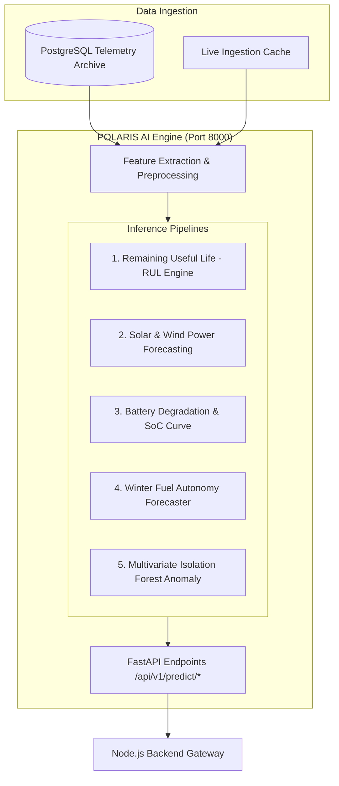

# POLARIS AI Service Architecture & Machine Learning Pipelines

## 1. Overview & Operational Mandate

In Antarctica, unexpected hardware failure can sever heating, communications, or life support when external temperatures fall below -50°C. Standard reactive maintenance is insufficient.

The **POLARIS AI Service** (implemented in **Python with FastAPI, Scikit-Learn, and Pandas**) provides real-time predictive analytics, anomaly detection, and autonomous operational forecasting.

---

## 2. Microservice Architecture

---

## 3. Targeted Machine Learning Capabilities (Phase 10 & 12)

### 1. Equipment Remaining Useful Life (RUL) Modeling
* **Target Machinery**: Primary and auxiliary Caterpillar diesel generators (DG1, DG2, DG3).
* **Input Features**: Vibration velocity RMS (mm/s), exhaust gas temperature (°C), lube oil pressure (bar), run-hours since overhaul, load factor (%).
* **Algorithm**: Weibull Hazard Rate Analysis combined with Random Forest Regressors trained on NASA C-MAPSS and simulated polar vibration degradation benchmarks.
* **Output**: Predicted operating hours remaining until failure threshold + confidence interval.

### 2. Renewable Energy Generation & Demand Forecasting
* **Target**: Solar PV arrays at Bharati and Maitri.
* **Input Features**: Solar elevation angle, cloud opacity proxy, barometric pressure trend, historical 24h temperature.
* **Algorithm**: Gradient Boosted Decision Trees (LightGBM/XGBoost).
* **Output**: 24-hour ahead solar generation curve (kW) to schedule diesel generator throttling and minimize carbon emissions.

### 3. Sub-Zero Battery Degradation Curves
* **Target**: Lithium-Iron-Phosphate (LFP) station reserve battery banks.
* **Challenge**: Cold temperatures drastically reduce effective battery capacity and increase internal cell resistance.
* **Algorithm**: Non-linear equivalent circuit regression model adjusted for cell temperature coefficients.
* **Output**: Accurate State-of-Charge (SoC) % and estimated emergency runtime under zero-generation conditions.

### 4. Winter Fuel Autonomy Predictor
* **Target**: Station bulk fuel tanks (Arctic Jet A-1 diesel).
* **Algorithm**: Dynamic multi-variable regression factoring weather severity forecasts, building heating demands, and generator thermal efficiencies.
* **Output**: "Days of Fuel Autonomy Remaining" with dynamic resupply warning thresholds.

---

## 4. API Endpoints

* `GET  /health`: Health status, version, and model registry check. *(Phase 0 Active)*
* `POST /predict/rul`: Evaluates equipment telemetry snapshot and returns RUL estimate.
* `POST /predict/energy-load`: 24h forward-looking power balance prediction.
* `POST /predict/fuel-depletion`: Estimated days of winter autonomy.
