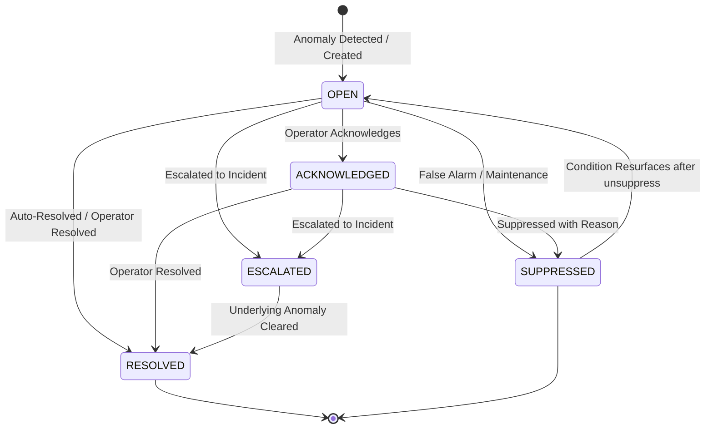
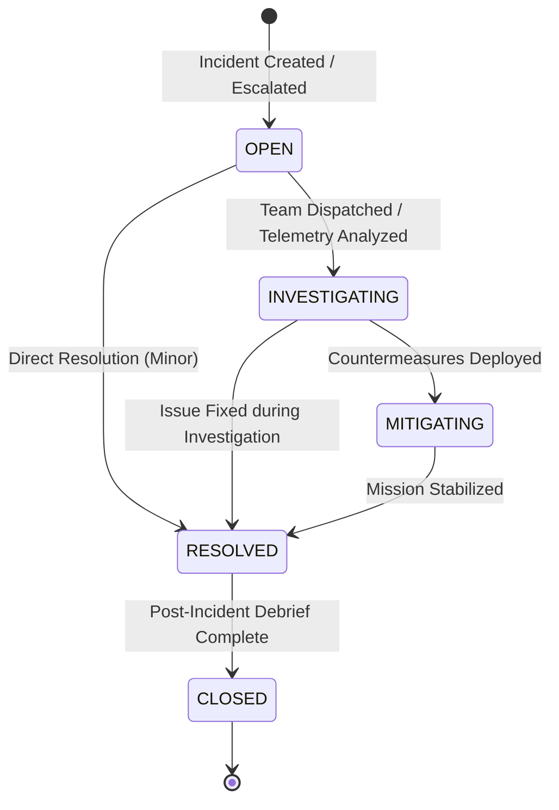
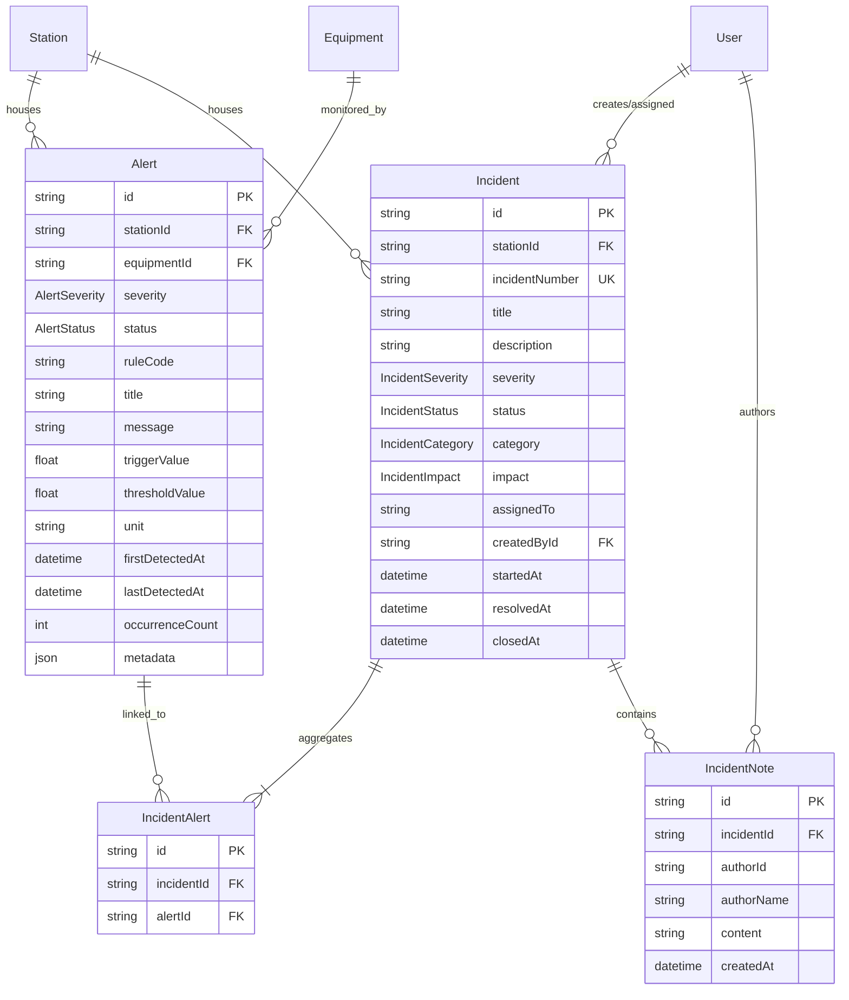

# POLARIS — Phase 9: Alerts & Incident Management Architecture

**Project:** POLARIS (Polar Operations & Logistics Automated Remote Intelligence System)  
**SIH Problem Statement:** SIH26060 — Digital Platform for efficient remote management of Indian Antarctic Research Stations  
**Target Stations:** Maitri (Schirmacher Oasis, 70°45′57″S 11°44′09″E) & Bharati (Larsemann Hills, 69°24′28″S 76°11′14″E)  
**Organization:** Ministry of Earth Sciences (MoES) / National Centre for Polar and Ocean Research (NCPOR)  
**Tagline:** "A Digital Twin for Smarter Antarctic Station Management."  
**Phase:** Phase 9 — Alerts + Incident Management  

---

## 1. System Architecture

The POLARIS Phase 9 subsystem provides deterministic, explainable, and real-time operational anomaly detection, alert lifecycle management, and incident command orchestration for both Antarctic research stations.

```
┌────────────────────────────────────────────────────────────────────────────────────────┐
│                                 TELEMETRY & STATE SOURCES                              │
│   • Sensor Simulator (Phase 4)   • Energy & Microgrid (Phase 7)                        │
│   • Digital Twin / Equip (Phase 6) • Environment Monitors (Phase 7) • Logistics (Phase 8)│
└───────────────────────────────────────────┬────────────────────────────────────────────┘
                                            │ Telemetry & State Cycles
                                            ▼
┌────────────────────────────────────────────────────────────────────────────────────────┐
│                              ALERT EVALUATION ENGINE                                   │
│   • Deterministic Threshold Evaluation (utils/alertRules.ts)                           │
│   • Rule Code Mapping: ENERGY_*, ENV_*, EQUIPMENT_*, INVENTORY_*, etc.                 │
│   • In-Memory Concurrency Mutex Lock (keyed by station:ruleCode:sourceId)              │
│   • Deduplication & Occurrence Counter                                                 │
│   • Auto-Resolution Engine with Hysteresis Windows                                     │
└─────────────────────┬────────────────────────────────────────────┬─────────────────────┘
                      │ Persistent Mutation                        │ Realtime Dispatch
                      ▼                                            ▼
┌───────────────────────────────────────────┐  ┌─────────────────────────────────────────┐
│           POSTGRESQL / PRISMA             │  │         REALTIME WEBSOCKET BUS          │
│   • alerts                                │  │   • alert:created   • alert:updated     │
│   • incidents                             │  │   • alert:resolved  • alert:escalated   │
│   • incident_alerts                       │  │   • incident:created• incident:status   │
│   • incident_notes                        │  │   • incident:assigned                   │
│   • operational_events (Audit Trail)      │  │   Envelope: eventId, seq, timestamp     │
└─────────────────────┬─────────────────────┘  └───────────────────┬─────────────────────┘
                      │                                            │
                      └─────────────────────┬──────────────────────┘
                                            ▼
┌────────────────────────────────────────────────────────────────────────────────────────┐
│                         FRONTEND ALERT COMMAND CENTER (/alerts)                        │
│   • Dual Command Center: Alerts Table & Incident Command Center Tabs                   │
│   • Real-Time React Query Cache Synchronization from WebSocket Event Bus               │
│   • Station Switcher: ALL / MAITRI / BHARATI (Zero cross-station leakage)              │
│   • Severity Hierarchy: CRITICAL (Red/Glow), HIGH (Orange), MEDIUM, LOW, INFO         │
│   • Action Drawers & Modals: Acknowledge, Escalate -> Incident, Resolve, Suppress       │
│   • Incident Lifecycle Stepper: OPEN -> INVESTIGATING -> MITIGATING -> RESOLVED -> CLOSED│
│   • Integrated Navigation: Dashboard & 3D Digital Twin Equipment Drawers               │
└────────────────────────────────────────────────────────────────────────────────────────┘
```

---

## 2. Alert Lifecycle

Alerts are machine-generated or operator-generated records indicating operational boundary breaches.

### State Transition Diagram


### Allowed Transitions Matrix
- **OPEN** &rarr; `ACKNOWLEDGED`, `ESCALATED`, `RESOLVED`, `SUPPRESSED`
- **ACKNOWLEDGED** &rarr; `ESCALATED`, `RESOLVED`, `SUPPRESSED`
- **ESCALATED** &rarr; `RESOLVED`
- **SUPPRESSED** &rarr; `OPEN`
- **RESOLVED** &rarr; Terminal (immutable except for audit inquiries)

---

## 3. Incident Lifecycle

Incidents represent multi-subsystem, mission-level operational scenarios requiring investigation, human coordination, and documented mitigation.

### Incident Lifecycle Stepper


### Transition Validation Rules
1. Backward transitions (e.g., `CLOSED` &rarr; `INVESTIGATING`) are rejected with `400 INVALID_INCIDENT_TRANSITION`.
2. Every status mutation generates an atomic `OperationalEvent` audit log containing the actor, previous state, new state, and optional operational notes.

---

## 4. Severity Model

Severity definitions are centralized in `utils/alertRules.ts` and shared across backend and frontend.

| Level | Visual Indicator | Operational Meaning | Action Expectation |
| :--- | :--- | :--- | :--- |
| **CRITICAL** | Crimson `#ef4444` / Pulsing Alarm | Immediate threat to life, station structural integrity, or primary power grid. | Immediate mitigation within <15 mins. Audible/tactile warning. |
| **HIGH** | Amber-Orange `#f97316` | Significant operational risk; loss of redundancy or communication blackouts. | Intervention required within <1 hour. |
| **MEDIUM / WARNING** | Yellow `#eab308` | Operational deviation or warning threshold breach requiring awareness. | Logged and monitored by next shift. |
| **LOW** | Cyan-Blue `#06b6d4` | Minor subsystem variance; maintenance advisory. | Handled during routine daily rounds. |
| **INFO** | Slate `#64748b` | Informational status update or telemetry recovery notification. | Passive logging. |

---

## 5. Alert Rule Engine

The alert rule engine (`AlertEvaluationService`) maps physical sensor thresholds from Phase 7 (Energy + Environment) and Phase 6/8 directly into explainable alerts without arbitrary logic.

### Centralized Thresholds & Rules

#### Energy Subsystem
- **Battery SoC Critical:** `< 20.0%` &rarr; `ENERGY_BATTERY_CRITICAL` (`CRITICAL`)
- **Battery SoC Warning:** `20.0% – 35.0%` &rarr; `ENERGY_BATTERY_LOW` (`WARNING`)
- **Battery Voltage Critical:** `< 460.0 V` &rarr; `ENERGY_VOLTAGE_CRITICAL` (`CRITICAL`)
- **Battery Voltage Warning:** `460.0 – 470.0 V` &rarr; `ENERGY_VOLTAGE_LOW` (`WARNING`)
- **Fuel Autonomy Critical:** `≤ 14.0 days` or `≤ 20.0%` &rarr; `ENERGY_FUEL_CRITICAL` (`CRITICAL`)
- **Fuel Autonomy Warning:** `14.0 – 30.0 days` or `20.0% – 40.0%` &rarr; `ENERGY_FUEL_LOW` (`WARNING`)
- **Severe Power Shortage:** `< -50.0 kW` &rarr; `ENERGY_POWER_SHORTAGE_CRITICAL` (`CRITICAL`)
- **Power Deficit Warning:** `-50.0 kW to -15.0 kW` &rarr; `ENERGY_POWER_SHORTAGE` (`HIGH`)

#### Environment Subsystem
- **Extreme Cold Blizzard:** `< -55.0°C` &rarr; `ENV_TEMP_EXTREME_COLD` (`CRITICAL`)
- **Sub-Zero Warning:** `-55.0°C to -40.0°C` &rarr; `ENV_TEMP_LOW` (`WARNING`)
- **Hurricane-Force Wind:** `> 80.0 km/h` &rarr; `ENV_WIND_BLIZZARD` (`CRITICAL`)
- **High Wind Warning:** `50.0 – 80.0 km/h` &rarr; `ENV_WIND_HIGH` (`WARNING`)
- **Cyclonic Pressure Plunge:** `< 955.0 hPa` &rarr; `ENV_PRESSURE_CYCLONIC` (`CRITICAL`)
- **Depression Warning:** `955.0 – 970.0 hPa` &rarr; `ENV_PRESSURE_LOW` (`WARNING`)
- **Optical Whiteout:** `< 1.0 km` &rarr; `ENV_VISIBILITY_WHITEOUT` (`CRITICAL`)
- **Restricted Visibility:** `1.0 – 5.0 km` &rarr; `ENV_VISIBILITY_POOR` (`WARNING`)

#### Equipment & Subsystems
- **Generator Core Overheat:** `> 95.0°C` &rarr; `EQUIPMENT_OVERHEAT_CRITICAL` (`CRITICAL`)
- **Equipment Health Critical:** Health `< 40%` or status `CRITICAL` &rarr; `EQUIPMENT_HEALTH_CRITICAL` (`CRITICAL`)
- **Equipment Health Degraded:** Health `40% – 60%` or status `WARNING` &rarr; `EQUIPMENT_HEALTH_DEGRADED` (`WARNING`)
- **Communication Blackout:** Quality `< 40%` &rarr; `COMMUNICATION_DEGRADED` (`HIGH`)

#### Logistics & Reserves
- **Critical Fuel Depletion:** Quantity `≤ criticalQuantity` &rarr; `INVENTORY_CRITICAL_FUEL` (`CRITICAL`)
- **Medical Emergency Depletion:** Quantity `≤ criticalQuantity` &rarr; `INVENTORY_CRITICAL_MEDICAL` (`CRITICAL`)
- **Stock Depletion (General):** Quantity `0` &rarr; `INVENTORY_OUT_OF_STOCK` (`HIGH`)

---

## 6. Deduplication Engine

The telemetry simulator cycles produce periodic readings every few seconds. Without deduplication, hundreds of identical alerts would flood the database.

### Deduplication Identity
Deduplication identity is composite:
$$\text{AlertKey} = \{\text{stationId}, \text{ruleCode}, \text{sourceId}\}$$

### Update Logic
When an existing active alert (`OPEN`, `ACKNOWLEDGED`, `ESCALATED`) matches the `AlertKey`:
1. **No new row is inserted.**
2. `occurrenceCount` is incremented ($N \to N+1$).
3. `triggerValue` is updated to the latest sensor value.
4. `lastDetectedAt` is updated to the current timestamp.
5. `firstDetectedAt` and original `createdAt` are strictly preserved.
6. A realtime `alert:updated` event is dispatched over WebSocket.

---

## 7. Auto-Resolution Engine & 8. Hysteresis

To prevent chattering around threshold boundaries, auto-resolution implements deliberate hysteresis windows.

| Metric | Trigger Threshold | Auto-Resolution Recovery Threshold | Hysteresis Buffer |
| :--- | :--- | :--- | :--- |
| **Wind Speed** | `> 80.0 km/h` | `< 75.0 km/h` | $5.0\text{ km/h}$ |
| **Battery SoC** | `≤ 20.0%` | `> 25.0%` | $5.0\%$ |
| **Generator Temp**| `> 95.0°C` | `< 90.0°C` | $5.0\text{ °C}$ |
| **Barometric Pressure**| `< 955.0 hPa` | `> 960.0 hPa` | $5.0\text{ hPa}$ |
| **Visibility** | `< 1.0 km` | `> 1.5 km` | $0.5\text{ km}$ |

When sensor values cross back into the safe recovery zone:
1. `alertEvaluationService.autoResolveAlert(...)` is invoked.
2. The active alert is transitioned to `RESOLVED`.
3. `resolvedBy` is tagged as `"SYSTEM_AUTO_RECOVERY"`.
4. An `OperationalEvent` audit log is recorded.
5. Realtime `alert:resolved` is broadcast to all station operators.

---

## 9. Database Schema (PostgreSQL + Prisma)

### Core Models & Relationships



### Database Indexes for High-Throughput Polar Querying
- `alerts(stationId, status, severity)`
- `alerts(stationId, ruleCode, sourceId)`
- `alerts(equipmentId, status)`
- `alerts(lastDetectedAt)`
- `incidents(stationId, status, severity)`
- `incidents(incidentNumber)`
- `incidents(assignedTo)`
- `incident_alerts(incidentId, alertId)` [Unique Composite]
- `incident_notes(incidentId, createdAt)`

---

## 10. REST API Specification

All endpoints are versioned under `/api/v1/` and follow the standard POLARIS response envelope: `{ success: true, data: ..., timestamp: ... }`.

### Alerts API (`/api/v1/alerts`)
- `GET /api/v1/alerts`: Paginated alert query with station, severity, status, source, and search filters.
- `GET /api/v1/alerts/overview`: Fleet-wide or station-specific KPI summaries.
- `GET /api/v1/alerts/:id`: Alert detail with linked incidents and equipment metadata.
- `POST /api/v1/alerts/:id/acknowledge`: Operator acknowledgement with optional memo.
- `POST /api/v1/alerts/:id/escalate`: Atomic escalation creating an Incident and linking the alert.
- `POST /api/v1/alerts/:id/resolve`: Manual alert resolution with documented resolution notes.
- `POST /api/v1/alerts/:id/suppress`: Alert suppression with mandatory operator justification.
- `GET /api/v1/alerts/:id/timeline`: Chronological audit trail of all operational events for this alert.

### Incidents API (`/api/v1/incidents`)
- `GET /api/v1/incidents`: Paginated incident listing with category, status, severity, and assignee filters.
- `GET /api/v1/incidents/overview`: Incident KPI breakdown (total, open, investigating, mitigating, resolved, closed).
- `GET /api/v1/incidents/:id`: Deep incident detail with linked alerts, notes, and timeline.
- `POST /api/v1/incidents`: Manual incident declaration with automatic sequential incident numbering.
- `PATCH /api/v1/incidents/:id`: Incident title, description, severity, or impact update.
- `POST /api/v1/incidents/:id/status`: Controlled lifecycle stepper mutation (`OPEN` &rarr; `INVESTIGATING` &rarr; `MITIGATING` &rarr; `RESOLVED` &rarr; `CLOSED`).
- `POST /api/v1/incidents/:id/assign`: Assign incident to authorized station operator.
- `POST /api/v1/incidents/:id/notes`: Add timestamped operational observation note.
- `POST /api/v1/incidents/:id/alerts`: Link additional secondary alert to this incident.
- `DELETE /api/v1/incidents/:id/alerts/:alertId`: Unlink alert from incident.
- `GET /api/v1/incidents/:id/timeline`: Chronological incident events log.

---

## 11. Role-Based Access Control (RBAC) & Station Isolation

POLARIS enforces strict multi-tenant station isolation between **Maitri** and **Bharati**.

### Permission Matrix

| Role | Alerts View | Acknowledge Alert | Escalate / Resolve / Suppress | Create Incident | Incident Stepper | Add Notes |
| :--- | :---: | :---: | :---: | :---: | :---: | :---: |
| **VIEWER** | Yes | Read-Only | Read-Only | Read-Only | Read-Only | Read-Only |
| **OPERATOR** | Yes (Assigned Station) | Yes | Yes | Yes | Yes | Yes |
| **ADMIN** | Yes (All Stations) | Yes | Yes | Yes | Yes | Yes |

### Station Isolation Rules
1. Global aggregation (`stationId=ALL`) is permitted for fleet-wide situational awareness.
2. Mutation operations (`acknowledge`, `escalate`, `assign`, `status change`) strictly validate that the user has station permissions for the targeted entity.
3. Server-side validation guarantees an operator assigned exclusively to Maitri cannot mutate Bharati alerts or incidents.

---

## 12. WebSocket Real-Time Integration

Reuses the existing Phase 5 WebSocket infrastructure and event envelope without creating a second server.

### Dispatched Events Catalog
- `alert:created`
- `alert:updated`
- `alert:acknowledged`
- `alert:resolved`
- `alert:escalated`
- `alert:suppressed`
- `incident:created`
- `incident:updated`
- `incident:status_changed`
- `incident:assigned`
- `incident:resolved`

### Envelope Format
```json
{
  "type": "alert:created",
  "eventId": "evt_01J8X9...",
  "stationId": "station_maitri_uuid",
  "stationCode": "MAITRI",
  "sequence": 1420,
  "timestamp": "2026-09-29T12:00:00.000Z",
  "data": {
    "id": "alert_uuid",
    "severity": "CRITICAL",
    "status": "OPEN",
    "ruleCode": "ENV_WIND_BLIZZARD",
    "title": "Severe Blizzard Wind Velocity",
    "message": "Blizzard winds clocked at 88.5 km/h",
    "occurrenceCount": 1
  }
}
```

---

## 13. Operational Audit Logging

Every critical mutation writes an immutable record to the `operational_events` table with:
- `stationId`: Physical station context
- `type`: `"ALERT"` or `"INCIDENT"`
- `title`: e.g. `ALERT_ACKNOWLEDGED`, `INCIDENT_STATUS_CHANGED`
- `description`: Human-readable summary
- `occurredAt`: High-precision timestamp
- `metadata`: JSON payload containing actor ID, previous status, new status, and context parameters.

---

## 14. Simulator Integration (Phase 4)

Integrated via `alertEvaluationService.evaluateTelemetryCycle(cycle)` called on every simulator cycle tick.
- Energy telemetry &rarr; Evaluates battery SoC, bus voltages, fuel levels, power balance.
- Environment telemetry &rarr; Evaluates temperature, wind speeds, barometric pressure, optical visibility.
- Equipment telemetry &rarr; Evaluates generator temperatures, vibration, operational status.

---

## 15. Energy & Environment Integration (Phase 7)

Directly reuses Phase 7 operational thresholds. No duplicate or conflicting thresholds exist. Any shift in solar generation deficit or blizzard onset instantly triggers deterministic alerts.

---

## 16. Equipment & Digital Twin Integration (Phase 6)

In `frontend/src/components/digital-twin/EquipmentInfoPanel.tsx`:
- When equipment has active alarms, the 3D scene illuminates an alert status light.
- The equipment drawer displays active alerts with direct deep-links to `/alerts`.

---

## 17. Logistics & Inventory Integration (Phase 8)

Critical reserves evaluated:
- Fuel stock depleted &rarr; `INVENTORY_CRITICAL_FUEL` (`CRITICAL`)
- Medical rations depleted &rarr; `INVENTORY_CRITICAL_MEDICAL` (`CRITICAL`)
- Any inventory item reaching zero &rarr; `INVENTORY_OUT_OF_STOCK` (`HIGH`)

---

## 18. Testing & Verification

Comprehensive test suites verify zero regression across all project phases.

### Phase 9 Test Suite Breakdown (`alerts-incidents-tests.ts`)
- **Group 1:** Alert Creation & Deterministic Rule Evaluation (2 tests)
- **Group 2:** Alert Deduplication & Occurrence Tracking (2 tests)
- **Group 3:** Alert Lifecycle & State Transitions (5 tests)
- **Group 4:** Auto-Resolution with Recovery & Hysteresis (1 test)
- **Group 5:** Incident Creation & Sequential Incident Numbering (2 tests)
- **Group 6:** Incident Lifecycle & Transitions (2 tests)
- **Group 7:** Incident Assignment, Notes & Linking (3 tests)
- **Group 8:** RBAC & Station Isolation (2 tests)
- **Group 9:** Operational Event Audit Logging (1 test)
- **Group 10:** Real-Time Event Bus Dispatches (1 test)
- **Group 11:** End-to-End Multi-Domain Integration (1 test)
- **Group 12:** Concurrency & Idempotency Protection (1 test)
- **Additional Edge Cases:** Cold, Whiteout, Power Deficit, Validation, Filtering, Pagination, Overview KPIs, Timeline (15 tests)

**Total Phase 9 Tests:** 38 / 38 Passed (100%)  
**Unified Project Test Suite:** 204 / 204 Passed (100%) across Phases 2, 3, 4, 5, 7, 8, and 9.

---

## 19. Known Limitations & Phase 10 Boundaries

### Explicit Phase 10 Boundary
Phase 9 is strictly deterministic and rule-based:
- **NO AI Predictive Maintenance:** No machine learning models, Remaining Useful Life (RUL) estimates, or failure probability calculations.
- **NO AI Forecasting:** Weather and energy forecasts remain deterministic simulation models.
- **NO AI Copilot / LLM Chat:** No natural language assistant.
- **NO Custom Report Builder:** Reserved for Phase 11 Analytics.

### Operational Constraints
1. **Satellite Link Latency:** In true Antarctic deployment, WebSocket events are queued during communication blackouts. The sequence manager preserves order upon reconnection.
2. **Hysteresis Tuning:** Default hysteresis buffers are calibrated to historical polar weather patterns and can be fine-tuned via station configuration files without code alterations.
