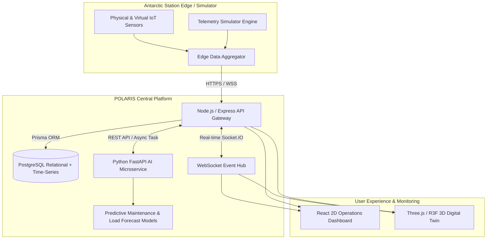

# POLARIS System Architecture Specification

## 1. Product Overview

**POLARIS** (*Polar Operations & Logistics Automated Remote Intelligence System*) is a centralized, digital twin-enabled monitoring and operations platform purpose-built for the **National Centre for Polar and Ocean Research (NCPOR)**, under the **Ministry of Earth Sciences (MoES)** for **Smart India Hackathon 2026** (Problem Statement ID: **SIH26060**).

The system addresses the severe challenges of operating and maintaining India's remote Antarctic research stations:
1. **Maitri** (70°45′58″S, 11°44′09″E; Schirmacher Oasis; inland rocky terrain)
2. **Bharati** (69°24′26″S, 76°11′14″E; Larsemann Hills; coastal energy-efficient outpost)

Antarctica presents extreme environmental challenges: temperatures down to -60°C, Katabatic winds exceeding 150 km/h, months of continuous polar night, and limited satellite communication windows. POLARIS aggregates life support, power generation, weather telemetry, inventory, and equipment diagnostics into a high-reliability digital twin dashboard with AI-driven predictive maintenance and autonomy forecasting.

---

## 2. High-Level Architecture

The POLARIS architecture follows a modular, decoupled microservice pattern optimized for local edge station resilience and remote command center synchronization:



---

## 3. Frontend Architecture

The frontend is built using **React 18**, **Vite**, **TypeScript**, and **Tailwind CSS**, structured strictly by domain:

```
frontend/src/
├── app/                  # Application root wrappers & providers
├── assets/               # 3D models (GLTF/GLB), textures, static assets
├── components/           # Component library
│   ├── ui/               # Atomic design primitives (Buttons, Cards, Badges, Modals)
│   ├── layout/           # Header, Sidebar, Station Selector, Footer
│   ├── dashboard/        # KPI metrics, summaries, overview cards
│   ├── station/          # Station metadata, room views, zone hierarchies
│   ├── charts/           # Recharts time-series telemetry visualizations
│   ├── equipment/        # Machinery status cards, maintenance logs
│   ├── alerts/           # Incident triage tables and notification bells
│   ├── logistics/        # Fuel reserves, food stores, cargo manifests
│   └── digital-twin/     # Three.js canvas, R3F models, camera controls
├── pages/                # Route level compositions
├── routes/               # Declarative client-side routing
├── hooks/                # Custom React hooks (telemetry, socket, health)
├── services/             # HTTP API client layer (Axios)
├── lib/                  # Utilities (clsx, tailwind-merge, formatting)
├── types/                # Central TypeScript domain interfaces
├── utils/                # Date, calculation, and unit conversion helpers
├── constants/            # Station coordinates, threshold configurations
└── styles/               # Polar theme tokens and Tailwind CSS rules
```

**Key Principles:**
- Complete decoupling of 3D WebGL rendering logic from standard 2D dashboard state.
- Centralized API communications through typed service methods.
- Strict state isolation to prevent unnecessary re-renders during high-frequency telemetry updates.

---

## 4. Backend Architecture

The backend operates as an **Express + TypeScript** API and WebSocket server adhering to a clean layered architecture:

```
Request ──> Express Router ──> Middleware (Auth / RateLimit / Logger)
                 │
                 ▼
             Validator (Zod Schema)
                 │
                 ▼
             Controller (HTTP Context Handler)
                 │
                 ▼
             Service Layer (Business Logic & Orchestration)
                 │
         ┌───────┴───────┐
         ▼               ▼
   Repository Layer  AI Service Client / WebSocket Emitter
         │
         ▼
   Database (Prisma / PostgreSQL)
```

**Layers:**
- **Routes (`src/routes/`)**: Expose REST endpoints under `/api/v1/*`.
- **Controllers (`src/controllers/`)**: Parse HTTP parameters and invoke services.
- **Validators (`src/validators/`)**: Validate request payloads using Zod schemas.
- **Services (`src/services/`)**: Implement business logic, threshold checks, and event dispatch.
- **Repositories (`src/repositories/`)**: Encapsulate database queries.
- **WebSocket (`src/websocket/`)**: Manage Socket.IO rooms, connection states, and broadcasts.

---

## 5. Database Architecture

Powered by **PostgreSQL** with **Prisma ORM**, the database is normalized into four distinct sub-schemas:
1. **Station & Spatial Hierarchy**: `Station` -> `Building` -> `Floor` -> `Room` -> `Equipment`.
2. **Telemetry & Time-Series**: `SensorReading`, `EnergyReading`, `EnvironmentalReading`.
3. **Logistics & Inventory**: `InventoryItem`, `InventoryTransaction`, `Shipment`, `SupplyRequest`.
4. **Operations & Governance**: `MaintenanceRecord`, `Alert`, `Incident`, `User`, `Role`, `AuditLog`.

---

## 6. Real-Time Architecture

Telemetry is pushed over **Socket.IO** with automatic reconnect backoff and fallback polling:
- **Station-Specific Rooms**: Clients join `station:bharati` or `station:maitri`.
- **Event Topics**:
  - `sensor:update`: Granular sensor readings.
  - `energy:update`: Station battery SoC, diesel kW, solar kW.
  - `environment:update`: Wind speed, outdoor temperature, barometric pressure.
  - `alert:new`: Emergency threshold breaches.
- **Connection States**: `LIVE` (green), `RECONNECTING` (amber), `OFFLINE` (red).

---

## 7. AI Architecture

The **FastAPI AI Microservice** provides inference pipelines:
- **Remaining Useful Life (RUL)**: Multi-feature degradation curves for diesel generators.
- **Solar & Wind Forecasting**: Estimates generation based on atmospheric pressure and date.
- **Fuel Autonomy Modeling**: Calculates days of fuel reserves remaining under severe blizzard conditions.

---

## 8. Sensor Simulator

Because live Antarctic satellite links are constrained during the hackathon, the simulator generates realistic synthetic telemetry:
- Ambient temperature: -60°C to +5°C.
- Wind velocity: 0 to 180 km/h (Katabatic storm simulation).
- Operating modes: `NORMAL`, `WARNING`, `CRITICAL`, `STORM`, `POWER_FAILURE`, `EQUIPMENT_FAILURE`.

---

## 9. Digital Twin Architecture

The 3D Digital Twin renders a photorealistic interactive representation of Maitri and Bharati:
- Built with **Three.js**, **React Three Fiber (R3F)**, and **Drei**.
- **Entity ID Mapping**: Every 3D mesh (e.g. `mesh_dg_01`) maps directly to an `Equipment.id` in PostgreSQL.
- Visual state reflection: Real-time telemetry changes mesh emissive colors, displays warning halos, or reveals cross-sectional cutaways.

---

## 10. Security Boundaries

- **Transport Security**: TLS 1.3 encryption across all communication links.
- **API Defense**: Helmet headers, strict CORS whitelisting, rate limiting (express-rate-limit).
- **Authentication**: JWT access tokens (15m expiration) with secure refresh token rotation in HTTP-only cookies.
- **RBAC Matrix**: `SUPER_ADMIN`, `STATION_ADMIN`, `OPERATOR`, `SCIENTIST`, `LOGISTICS_MANAGER`, `VIEWER`.
- **Audit Trails**: All state mutations and remote override commands are logged immutably.

---

## 11. Deployment Architecture

The application is fully containerized using **Docker Compose**:
- `polaris_frontend`: Nginx serving optimized static React bundle.
- `polaris_backend`: Node.js 20 Alpine container.
- `polaris_ai`: Python 3.11 Slim container with Uvicorn.
- `polaris_postgres`: PostgreSQL 16 Alpine with persistent named volumes.

---

## 12. Analytics & Reporting Architecture (Phase 11)

The Phase 11 Analytics & Reporting subsystem processes historical multi-domain operational data into actionable intelligence:
- **Dedicated Domain Services**: Energy, Environment, Equipment, Maintenance (Phase 10 integration), Alerts, Incidents, Logistics, and Station Comparison.
- **Deterministic Summaries**: Automated executive summaries generated via deterministic templates (preserving the Phase 12 AI Assistant boundary).
- **Report Generation & Export**: 9 standard operational report templates with CSV raw export and print-ready HTML/PDF formatting.
- **Data Quality Assurance**: Telemetry completeness scoring (`GOOD` $\ge 90\%$, `LIMITED` $50\% - 89.9\%$, `POOR` $< 50\%$) with explicit data gap detection.
- **RBAC & Station Isolation**: Strict role-scoped access control preventing unauthorized multi-station data exposure.

---

## 13. AI Operations Assistant Architecture (Phase 12)

The Phase 12 AI Operations Assistant delivers natural-language conversational intelligence over actual POLARIS data:
- **Zero Hallucination / Grounded Execution**: Answers are derived strictly from 21 allowlisted operational tools and PostgreSQL records.
- **No Autonomous Station Control**: Advisory and informational only. Write operations produce an amber `ProposedAction` card requiring explicit operator confirmation via native module workflows.
- **Anti-Injection & Security Defense**: Pre-execution input sanitization blocks prompt overrides, secret dumps, and unauthorized SQL generation.
- **Pluggable Provider System**: Swappable abstraction supporting deterministic zero-token instant synthesis (`DeterministicAiProvider`) or Google Gemini (`GeminiProvider`) with automatic fallback.
- **Real-Time Streaming**: Server-Sent Events (SSE) `/assistant/chat/stream` delivering incremental tokens, source citations, data freshness badges, and tool audit logs.
- **Station Isolation & RBAC**: Station permissions and user roles (`ADMIN`, `OPERATOR`, `VIEWER`) are strictly enforced server-side.

