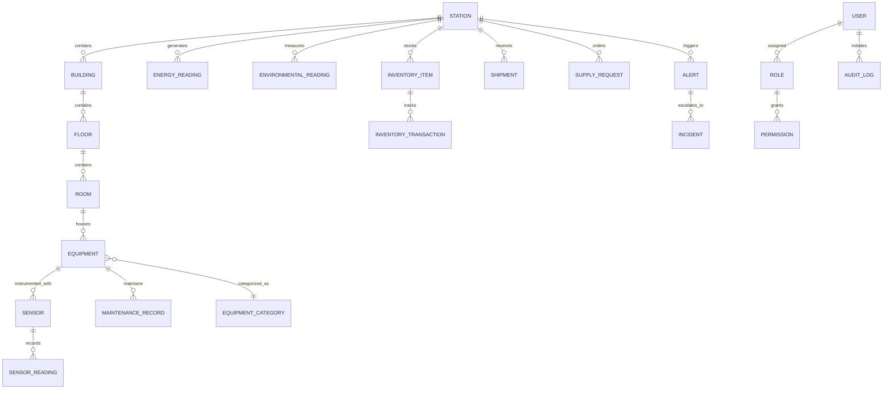

# POLARIS Database Design Specification

## 1. Architectural Strategy

The database architecture is designed for **PostgreSQL 16** via **Prisma ORM**. It unifies two critical data models:
1. **Relational Model**: Rigid relational consistency for Station hierarchy, Equipment assets, Inventory, Maintenance records, Incidents, Users, and Permissions.
2. **Time-Series Telemetry**: High-frequency environmental and energy readings indexed on timestamps and partitioned for efficient aggregation.

---

## 2. Entity Relationship Diagram (ERD)



---

## 3. Detailed Entity Dictionary

### Hierarchy & Spatial Entities
* **`Station`**: Represents an Antarctic research facility.
  * Fields: `id`, `code` (`MAITRI` | `BHARATI`), `name`, `latitude`, `longitude`, `altitudeMeters`, `commissionedYear`, `status`, `capacity`.
* **`Building`**: Physical structure on station grounds.
  * Fields: `id`, `stationId`, `name`, `type` (`MAIN_BASE`, `GENERATOR_HOUSE`, `EARTH_STATION`), `coordinates`.
* **`Floor`**: Vertical elevation within a building.
  * Fields: `id`, `buildingId`, `levelNumber`, `blueprintAssetRef`.
* **`Room`**: Functional room unit.
  * Fields: `id`, `floorId`, `name`, `roomNumber`, `type` (`LAB`, `LIVING`, `GENERATOR`, `SERVER_ROOM`).

### Assets & IoT Sensors
* **`Equipment`**: Machinery or life-support system.
  * Fields: `id`, `roomId`, `categoryId`, `name`, `modelNumber`, `serialNumber`, `healthScore`, `status`, `digitalTwinMeshId`.
* **`EquipmentCategory`**: `POWER_GENERATION`, `HVAC`, `WATER_SYSTEM`, `COMMUNICATION`, `LABORATORY`.
* **`Sensor`**: Hardware monitoring probe.
  * Fields: `id`, `equipmentId` (nullable), `roomId` (nullable), `type` (`TEMP`, `VIBRATION`, `CURRENT`, `FLOW`, `PRESSURE`), `unit`.

### Time-Series Telemetry Entities
* **`SensorReading`**: Individual sensor point.
  * Fields: `id`, `sensorId`, `timestamp`, `value`, `rawVoltage`, `statusFlag`.
  * Index: `(sensorId, timestamp DESC)`.
* **`EnergyReading`**: Station power balance snapshot.
  * Fields: `id`, `stationId`, `timestamp`, `solarKw`, `dieselKw`, `loadKw`, `batterySoC`, `batteryVoltage`, `fuelReservesLiters`.
  * Index: `(stationId, timestamp DESC)`.
* **`EnvironmentalReading`**: Outer Antarctic weather.
  * Fields: `id`, `stationId`, `timestamp`, `temperatureC`, `windSpeedKmh`, `windDirDeg`, `pressureHpa`, `solarRadiationWm2`, `snowfallRateMmH`.
  * Index: `(stationId, timestamp DESC)`.

### Logistics, Maintenance & Operations
* **`InventoryItem`**: Stored provisions or technical parts.
  * Fields: `id`, `stationId`, `sku`, `name`, `category` (`FUEL`, `FOOD`, `MEDICINE`, `SPARE_PARTS`), `quantity`, `unit`, `reorderThreshold`.
* **`InventoryTransaction`**: Stock movements.
  * Fields: `id`, `inventoryItemId`, `changeAmount`, `type` (`CONSUMPTION`, `RESTOCK`, `EXPIRY`, `TRANSFER`), `timestamp`, `userId`.
* **`MaintenanceRecord`**: Preventative/predictive work orders.
  * Fields: `id`, `equipmentId`, `type` (`SCHEDULED`, `EMERGENCY`, `PREDICTIVE_RUL`), `status` (`OPEN`, `IN_PROGRESS`, `COMPLETED`), `scheduledDate`, `completedDate`, `technicianId`.
* **`Alert`**: Active threshold breach.
  * Fields: `id`, `stationId`, `severity` (`INFO`, `WARNING`, `CRITICAL`, `EMERGENCY`), `source`, `message`, `status` (`OPEN`, `ACKNOWLEDGED`, `RESOLVED`), `createdAt`.
* **`Incident`**: Formally managed operational disruption.
  * Fields: `id`, `stationId`, `alertId`, `title`, `rootCause`, `actionTaken`, `status`, `reportedById`.

---

## 4. Time-Series Storage & Retention Guidelines

1. **Partitioning**: Telemetry tables (`sensor_readings`, `environmental_readings`, `energy_readings`) are partition-ready by month using PostgreSQL declarative partitioning:
   ```sql
   CREATE TABLE environmental_readings_2026_01 PARTITION OF environmental_readings
       FOR VALUES FROM ('2026-01-01 00:00:00+00') TO ('2026-02-01 00:00:00+00');
   ```
2. **Indexing**: Composite indexing `(station_id, timestamp DESC)` ensures `SELECT * FROM environmental_readings WHERE station_id = $1 ORDER BY timestamp DESC LIMIT 100` executes in sub-millisecond time.
3. **Rollup & Retention Schedule**:
   * Raw Telemetry (1-5s intervals): Retained for **30 days**.
   * Hourly Rollups (AVG, MIN, MAX): Retained for **365 days**.
   * Daily Scientific Aggregates: Retained **indefinitely** for NCPOR research archival.
