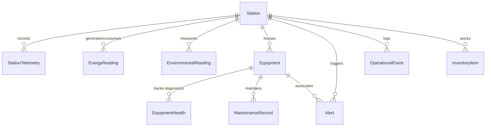

# POLARIS Database Design Specification (Phase 2)

**Polar Operations & Logistics Automated Remote Intelligence System**  
*SIH 2026 Problem Statement ID: SIH26060*  
*Organization: Ministry of Earth Sciences (MoES) / National Centre for Polar and Ocean Research (NCPOR)*

---

## 1. Database Architecture Overview

POLARIS utilizes **PostgreSQL** as its enterprise-grade relational and time-series data storage engine, paired with **Prisma ORM (v6.4.1)** for schema migrations, strictly typed database access, and relationship mapping.

The data layer follows a strict multi-tier architecture:
```
           FRONTEND (React 18 + Vite)
                       │
                       ▼
              REST API (/api/v1)
                       │
                  Controllers (Express thin handlers)
                       │
                   Services (Domain logic & pagination)
                       │
                 Repositories (Prisma queries & data access)
                       │
                    Prisma Client (Singleton connection pool)
                       │
                  PostgreSQL (Port 5432)
```

Direct database access from route handlers or controllers is strictly prohibited. All queries flow through dedicated repositories and services.

---

## 2. Core Entities and Schema Models

The Phase 2 schema defines 10 normalized domain models:

### 1. `Station`
Represents an Indian Antarctic research facility (`MAITRI` or `BHARATI`).
* **Attributes**: `id` (UUID), `code` (String, unique), `name`, `description`, `tagline`, `latitude`, `longitude`, `altitude`, `timezone`, `status` (`StationStatus`), `healthPercent` (Float), `commissionedYear`, `personnelCapacity`, `currentPersonnel`, `createdAt`, `updatedAt`.
* **Table**: `stations`

### 2. `StationTelemetry`
High-frequency observations ingested from station SCADA / weather sensors.
* **Attributes**: `id` (UUID), `stationId` (FK), `recordedAt` (UTC DateTime), `temperature` (Float °C), `humidity` (Float %), `pressure` (Float hPa), `windSpeed` (Float km/h), `windDirection` (Float °), `visibility` (Float km), `createdAt`.
* **Table**: `station_telemetry`

### 3. `EnergyReading`
Station energy balance, power generation, battery bank state-of-charge, and fuel autonomy reserves.
* **Attributes**: `id` (UUID), `stationId` (FK), `recordedAt` (UTC DateTime), `generationKw` (Float), `solarKw` (Float), `dieselKw` (Float), `consumptionKw` (Float), `netPowerKw` (Float: `generationKw - consumptionKw`), `batteryPercent` (Float %), `batteryVoltage` (Float V), `fuelPercent` (Float %), `fuelLiters` (Float L), `fuelDaysRemaining` (Float), `createdAt`.
* **Table**: `energy_readings`

### 4. `EnvironmentalReading`
Microclimate and meteorological readings.
* **Attributes**: `id` (UUID), `stationId` (FK), `recordedAt` (UTC DateTime), `temperature` (Float °C), `humidity` (Float %), `pressure` (Float hPa), `windSpeed` (Float km/h), `windDirection` (Float °), `windDirectionCompass` (String: "SE", "S"), `visibility` (Float km), `solarRadiation` (Float W/m²), `snowfallRate` (Float mm/h), `status` (`TelemetryStatus`), `createdAt`.
* **Table**: `environmental_readings`

### 5. `Equipment`
Critical station life support machinery, power generators, HVAC units, water purification, and telecom equipment.
* **Attributes**: `id` (UUID), `stationId` (FK), `code` (String), `name`, `category` (`EquipmentCategory`), `status` (`EquipmentStatus`), `healthPercent` (Float), `manufacturer`, `model`, `installedAt`, `lastServiceAt`, `createdAt`, `updatedAt`.
* **Table**: `equipment`
* **Constraint**: `UNIQUE (stationId, code)`

### 6. `EquipmentHealth`
Periodic diagnostic readings (temperature, vibration, runtime) used by future predictive maintenance and RUL algorithms.
* **Attributes**: `id` (UUID), `equipmentId` (FK), `recordedAt` (UTC DateTime), `healthPercent` (Float), `temperature` (Float °C), `vibration` (Float mm/s), `runtimeHours` (Float), `status` (`EquipmentStatus`), `notes`, `createdAt`.
* **Table**: `equipment_health`

### 7. `Alert`
Operational anomalies, threshold breaches, and alarm events across station subsystems.
* **Attributes**: `id` (UUID), `stationId` (FK), `equipmentId` (Nullable FK), `severity` (`AlertSeverity`), `title`, `description`, `status` (`AlertStatus`), `source`, `occurredAt`, `acknowledgedAt`, `resolvedAt`, `createdAt`, `updatedAt`.
* **Table**: `alerts`

### 8. `OperationalEvent`
Chronological mission events and automated audit logs displayed in the mission control timeline.
* **Attributes**: `id` (UUID), `stationId` (FK), `type` (String: TELEMETRY, HEALTH_CHECK, BATTERY, INVENTORY, WEATHER, MAINTENANCE), `title`, `description`, `occurredAt`, `metadata` (JSON serialized String), `createdAt`.
* **Table**: `operational_events`

### 9. `InventoryItem`
Antarctic expedition logistics, fuel reserves, replacement filters, medical supplies, and dry rations.
* **Attributes**: `id` (UUID), `stationId` (FK), `sku` (String), `name`, `category`, `quantity` (Float), `unit`, `minimumQuantity` (Float), `status` (`InventoryStatus`), `lastUpdatedAt`, `createdAt`, `updatedAt`.
* **Table**: `inventory_items`
* **Constraint**: `UNIQUE (stationId, sku)`

### 10. `MaintenanceRecord`
Scheduled and completed service orders, inspections, and emergency repairs on critical equipment.
* **Attributes**: `id` (UUID), `equipmentId` (FK), `title`, `description`, `type` (`MaintenanceType`), `status` (`MaintenanceStatus`), `scheduledAt`, `startedAt`, `completedAt`, `notes`, `createdAt`, `updatedAt`.
* **Table**: `maintenance_records`

---

## 3. Relationships & Foreign Key Cascades



* **Station Cascades**: Deleting a `Station` will cascade delete all linked `StationTelemetry`, `EnergyReading`, `EnvironmentalReading`, `Equipment`, `Alert`, `OperationalEvent`, and `InventoryItem` records via `ON DELETE CASCADE`.
* **Equipment Cascades**: Deleting an `Equipment` record will cascade delete associated `EquipmentHealth` and `MaintenanceRecord` rows. Linked `Alert` rows have `equipmentId` set to `NULL` via `ON DELETE SET NULL` to preserve incident history.

---

## 4. Controlled Domain Enums

All state machines and taxonomies are enforced via PostgreSQL native enums:

1. **`StationStatus`**: `OPERATIONAL`, `DEGRADED`, `WARNING`, `CRITICAL`, `OFFLINE`
2. **`EquipmentCategory`**: `GENERATOR`, `HVAC`, `POWER_CONVERTER`, `COMMUNICATION`, `WATER_SYSTEM`, `BATTERY`, `FUEL_SYSTEM`, `OTHER`
3. **`EquipmentStatus`**: `OPERATIONAL`, `DEGRADED`, `WARNING`, `CRITICAL`, `OFFLINE`, `MAINTENANCE`
4. **`AlertSeverity`**: `INFO`, `WARNING`, `CRITICAL`
5. **`AlertStatus`**: `ACTIVE`, `ACKNOWLEDGED`, `RESOLVED`
6. **`InventoryStatus`**: `IN_STOCK`, `LOW_STOCK`, `OUT_OF_STOCK`
7. **`MaintenanceType`**: `PREVENTIVE`, `CORRECTIVE`, `INSPECTION`, `EMERGENCY`
8. **`MaintenanceStatus`**: `SCHEDULED`, `IN_PROGRESS`, `COMPLETED`, `CANCELLED`
9. **`TelemetryStatus`**: `NORMAL`, `WARNING`, `CRITICAL`

---

## 5. Primary Keys & ID Strategy

All models use **UUIDv4** strings as primary keys (`@id @default(uuid())`).  
Benefits:
* Zero collision risk across distributed stations (crucial for future offline-first local edge sync during satellite communication outages).
* Prevents sequential enumeration attacks.

---

## 6. Indexing Strategy

Operational queries are optimized with targeted composite and single-column indexes:

| Table | Index Columns | Purpose |
|---|---|---|
| `stations` | `code` (UNIQUE) | Fast lookups by station identifier (MAITRI / BHARATI) |
| `station_telemetry` | `(stationId, recordedAt DESC)` | Time-windowed telemetry history queries |
| `energy_readings` | `(stationId, recordedAt DESC)` | Energy charts and latest balance queries |
| `environmental_readings` | `(stationId, recordedAt DESC)` | Meteorological trends and weather queries |
| `equipment` | `(stationId, status)` | Filter equipment by operational health state |
| `equipment` | `(stationId, code)` (UNIQUE) | Ensure unique equipment tag per station |
| `equipment_health` | `(equipmentId, recordedAt DESC)`| Predictive diagnostics and vibration history |
| `alerts` | `(stationId, status)` | Active unacknowledged alerts panel queries |
| `alerts` | `(stationId, severity)` | Critical emergency triage queries |
| `alerts` | `(occurredAt DESC)` | Global chronological alert feed |
| `operational_events` | `(stationId, occurredAt DESC)`| Mission control audit timeline queries |
| `inventory_items` | `(stationId, status)` | Low-stock and out-of-stock reorder queries |
| `inventory_items` | `(stationId, sku)` (UNIQUE) | Unique logistics SKU per station |
| `maintenance_records` | `(equipmentId, status)` | Active work orders for machinery |
| `maintenance_records` | `(scheduledAt ASC)` | Upcoming scheduled maintenance calendar |

---

## 7. Timestamp Policy

All timestamps in the PostgreSQL database are strictly stored as **UTC (`DateTime @default(now())`)**.
* Raw dates are represented as ISO 8601 strings (`2026-09-28T18:00:00.000Z`) across all REST API payloads.
* Local timezone conversions (e.g. UTC+05:00 for Maitri/Bharati operations or local browser time) are performed exclusively in the client-side presentation layer.

---

## 8. Demo Data Baseline Strategy

The database seed (`backend/prisma/seed.ts`) populates realistic deterministic demonstration data aligned with Phase 1 frontend baselines:

* **Maitri Station**:
  * Health: ~98.0%
  * Temperature: -31.4°C
  * Humidity: 72%
  * Pressure: 982 hPa
  * Wind: 38 km/h
  * Battery: 82% (48.6 V)
  * Fuel: 68% (81,600 L reserves / ~68 days autonomy)
  * Generation: ~420 kW (Solar 145 kW, Diesel 275 kW)
  * Consumption: ~378 kW
  * Net Balance: +42 kW
* **Bharati Station**:
  * Health: ~94.0%
  * Temperature: -28.7°C
  * Humidity: 69%
  * Pressure: 978 hPa
  * Wind: 44 km/h
  * Battery: 74% (47.9 V)
  * Fuel: 61% (73,200 L reserves / ~61 days autonomy)
  * Generation: ~390 kW (Solar 110 kW, Diesel 280 kW)
  * Consumption: ~365 kW
  * Net Balance: +25 kW

*Notice: All values are for simulation and demonstration purposes only and do not represent classified or live operational station feeds.*

---

## 9. Migration & Seeding Commands

Developers can configure and inspect the database using standard npm scripts:

```bash
# Generate Prisma Client
npm --prefix backend run prisma:generate

# Run development migrations
npm --prefix backend run db:migrate

# Apply migrations in production
npm --prefix backend run db:deploy

# Execute deterministic idempotent seed
npm --prefix backend run db:seed

# Launch visual Prisma Studio UI
npm --prefix backend run db:studio

# Start PostgreSQL service daemon (for non-docker environments)
npm --prefix backend run db:start
```

---

## 10. Repository & Service Layer Architecture

* **Repository Layer (`backend/src/repositories/`)**:
  * `station.repository.ts`
  * `telemetry.repository.ts`
  * `energy.repository.ts`
  * `environment.repository.ts`
  * `equipment.repository.ts`
  * `alert.repository.ts`
  * `event.repository.ts`
  * `inventory.repository.ts`
  * `maintenance.repository.ts`
* **Service Layer (`backend/src/services/`)**:
  * Implements identifier resolution (UUID or station code), error checking (`ApiError.notFound`), pagination metadata computation, and query parameter translation.
* **Controller Layer (`backend/src/controllers/`)**:
  * Thin HTTP handlers that consume validated request inputs and serialize responses into standardized `{ success: true, data: ..., meta: ... }` envelopes.

---

## 11. Future Extensibility

The Phase 2 schema is engineered to seamlessly accommodate future phases without breaking schema migrations:
* **Phase 3 (Authentication & RBAC)**: User table linking roles and station assignments.
* **Phase 4 & 5 (IoT Simulator & WebSockets)**: High-speed ingestion feeding `station_telemetry` and `energy_readings`.
* **Phase 6 (3D Digital Twin)**: Mesh IDs and model references mapping to `equipment.id`.
* **Phase 9 (Predictive Maintenance AI)**: ML model training on `equipment_health` vibration and temperature time-series.
