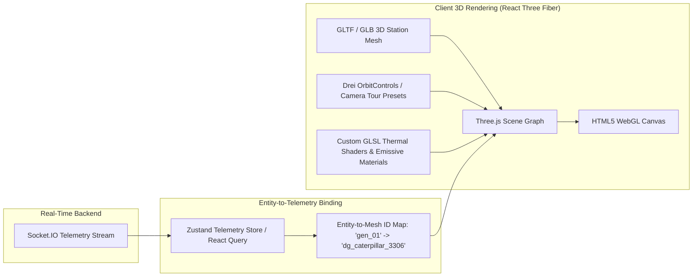

# POLARIS 3D Digital Twin Architecture

## 1. Executive Summary

A digital twin is more than a 3D visualization — it is an active bidirectional bridge between physical polar reality and remote operational intelligence. In POLARIS, the 3D Digital Twin provides the operations team at NCPOR headquarters with an immersive, spatial view of **Maitri** and **Bharati**.

---

## 2. Rendering Pipeline & Component Stack



---

## 3. Spatial Hierarchy & Entity ID Mapping

To ensure every 3D interaction connects to tangible data, every interactive mesh in the station GLB model embeds an `userData.entityId` attribute matching the PostgreSQL database:

```
[3D Scene Object]           [Database Entity]              [Live Telemetry]
mesh_bharati_gen_01  ───>  Equipment (ID: eq-gen-01)  ───>  DG1 kW / Temp / Vibration
mesh_maitri_fuel_tk2 ───>  Inventory (ID: inv-fuel-02) ───>  Fuel Level Liters
mesh_server_room_hvac───>  Equipment (ID: eq-hvac-04) ───>  Airflow & Duct Pressure
mesh_earth_station_01───>  Equipment (ID: eq-sat-01)  ───>  VSAT Link Quality (dB)
```

### Example Operational Interaction Flow
1. **Generator Overheats in Physical Reality**:
   * Sensor on DG1 detects temperature rising to 102°C.
2. **Backend Telemetry Processing**:
   * Telemetry processor triggers `ALERT_CRITICAL` and publishes `equipment:update`.
3. **Digital Twin Visual Alert**:
   * The 3D mesh `mesh_bharati_gen_01` smoothly pulses in glowing red emissive light.
4. **Operator Drill-down**:
   * Operator clicks the glowing 3D generator.
   * Camera automatically transitions to an isolated view of Generator Room 01.
   * 2D diagnostic drawer slides out displaying vibration RMS, oil pressure, and Remaining Useful Life (RUL) prediction.

---

## 4. Digital Twin Capabilities (Planned for Phase 6)

1. **Station Structural Transparency / Cutaway**:
   * Exploded view and roof cutaway modes allowing remote operators to peer inside living quarters, laboratories, and generator bays.
2. **Subsystem Layer Toggles**:
   * **Electrical Grid**: Visualizes power flow from solar panels and diesel generators into battery banks.
   * **Thermal & HVAC Grid**: Heatmap overlays showing temperature gradients across living modules.
   * **Life Support & Water**: Potable water piping and meltwater circulation paths.
3. **Environmental Skybox & Weather Simulation**:
   * Polar day / polar night dynamic lighting based on real-world solar elevation angles.
   * Particle blizzard effects responding to wind speed telemetry (> 80 km/h triggers heavy snow drift).
