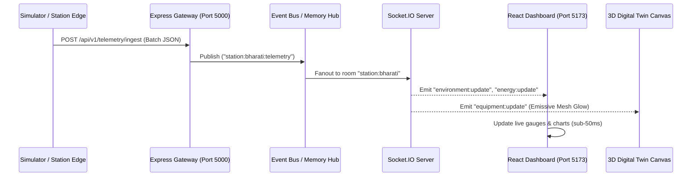
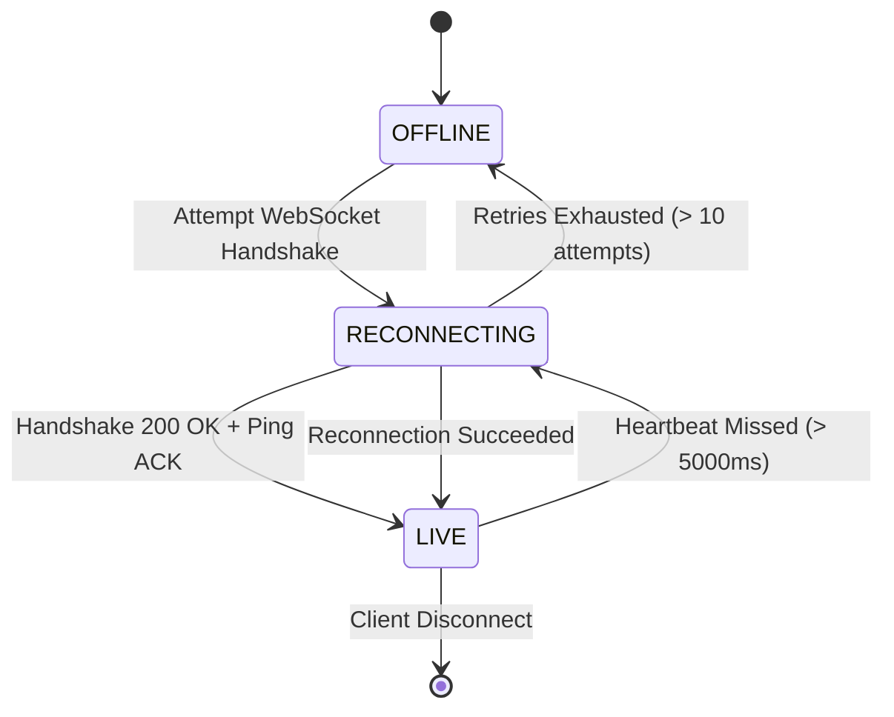

# POLARIS Real-Time WebSocket Architecture

## 1. Overview & Protocol Selection

In Antarctic operations, real-time awareness can be the difference between maintaining life support and catastrophic freeze-ups. POLARIS employs **Socket.IO** over persistent WebSockets for live telemetry streaming.

Socket.IO provides:
* Automatic reconnection backoff with jitter during high-latitude satellite link perturbations.
* Seamless transport fallback (WebSockets -> HTTP Long-Polling) when satellite proxy firewalls restrict WS upgrades.
* Built-in channel multiplexing via **Rooms**.

---

## 2. Telemetry Ingestion & Broadcast Flow

---

## 3. WebSocket Event Catalog

| Event Name | Direction | Payload Description | Frequency |
| :--- | :--- | :--- | :--- |
| `subscribe:station` | Client -> Server | `{ stationCode: "BHARATI" }` (Joins room) | On station switch |
| `unsubscribe:station` | Client -> Server | `{ stationCode: "MAITRI" }` (Leaves room) | On station switch |
| `environment:update` | Server -> Client | Weather: temp, wind speed, pressure, visibility | 1s - 3s interval |
| `energy:update` | Server -> Client | Power balance: solar kW, DG kW, battery SoC % | 1s - 3s interval |
| `sensor:update` | Server -> Client | Granular equipment sensor reading & status | 1s interval |
| `equipment:update` | Server -> Client | Health index change, status change (OPTIMAL -> WARNING) | On status shift |
| `alert:new` | Server -> Client | Immediate alert banner, audio chime trigger | Instant (Event) |
| `alert:update` | Server -> Client | Acknowledged or resolved alert state update | Instant (Event) |
| `maintenance:update` | Server -> Client | Work order state progression | On dispatch/done |
| `inventory:update` | Server -> Client | Critical fuel or medicine threshold alert | On consumption |

---

## 4. Client Connection Lifecycle State Machine

The React frontend UI tracks connectivity via three strict states:

* **`LIVE` (Green)**: Real-time streams active; latency < 200ms.
* **`RECONNECTING` (Amber Pulse)**: Connection lost; client attempting exponential backoff; UI freezes last known timestamp with warning banner.
* **`OFFLINE` (Red)**: Satellite connection severed; client switches to local cache fallback mode.
