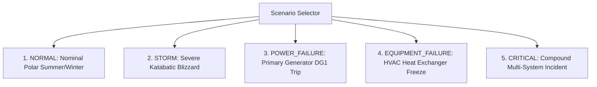

# POLARIS Telemetry & Sensor Simulator Specification

## 1. Overview & Objectives

In live Antarctic operations, satellite communication to **Maitri** and **Bharati** is bandwidth-constrained and intermittent. During development and SIH demonstration, a hardware sensor testbed is impossible to physically wire into the Arctic ice.

The **POLARIS Simulator Engine** (to be activated in **Phase 4**) is a physics-informed telemetry generator that synthesizes realistic polar weather fluctuations, electrical grid interactions, and equipment wear dynamics.

---

## 2. Sensor Domains & Realistic Antarctic Values

```
                                  POLARIS SIMULATOR
                                          │
         ┌───────────────────┬────────────┴────────┬───────────────────┐
         ▼                   ▼                     ▼                   ▼
    ENVIRONMENT            ENERGY           INFRASTRUCTURE         EQUIPMENT
  - Ambient Temp      - Solar kW Array     - Room Temp (20°C)   - DG Vibration
  - Wind Velocity     - DG 1/2/3 kW        - Server Room Temp   - Oil Pressure
  - Pressure (hPa)    - Battery SoC %      - HVAC Air Flow      - Exhaust Gas Temp
  - Solar W/m²        - Fuel Tank (L)      - RO Meltwater (L)   - VSAT Link dB
```

### Realistic Range Parameter Table

| Subsystem | Sensor Parameter | Typical Range | Emergency / Extreme Range | Unit |
| :--- | :--- | :--- | :--- | :--- |
| **Atmospheric** | Ambient Temperature | -35°C to -10°C | -62°C to +4°C | °C |
| **Atmospheric** | Wind Velocity | 15 to 45 km/h | 90 to 180 km/h (Katabatic storm) | km/h |
| **Atmospheric** | Barometric Pressure | 985 to 1020 hPa | 940 to 975 hPa (Rapid low) | hPa |
| **Atmospheric** | Solar Irradiance | 0 to 950 W/m² | 0 W/m² (Winter night) | W/m² |
| **Power** | Solar PV Output | 0 to 60 kW | 0 kW (Blizzard) | kW |
| **Power** | DG Active Load | 40 to 120 kW | 150 kW (Overload) | kW |
| **Power** | Battery Bank SoC | 65% to 98% | < 25% (Critical discharge) | % |
| **Power** | Battery Bus Voltage | 480 to 520 V | < 420 V | V |
| **Life Support** | Habitation Room Temp| 19°C to 22°C | < 12°C (Heating failure) | °C |
| **Life Support** | Server Room Temp | 17°C to 20°C | > 28°C (Cooling failure) | °C |
| **Machinery** | DG Bearing Vibration| 0.8 to 2.2 mm/s | > 6.5 mm/s (Bearing failure) | mm/s |
| **Machinery** | Generator Coolant | 80°C to 90°C | > 103°C (Overheat trip) | °C |

---

## 3. Simulation Operational Scenarios

The simulator provides predefined operational scenario presets for testing and hackathon judging:



1. **`NORMAL`**: Standard diurnal variations, smooth generator load balance, nominal battery cycling.
2. **`STORM`**: Wind velocity spikes from 30 km/h to 140 km/h over 3 minutes; visibility plunges below 100 meters; solar irradiance drops to 0 W/m²; ambient temperature drops by 15°C.
3. **`POWER_FAILURE`**: Primary generator DG1 suffers sudden mechanical trip; automatic transfer switch engages battery backup within 15 milliseconds; non-essential science lab loads shed automatically.
4. **`EQUIPMENT_FAILURE`**: HVAC ventilation heating coil suffers freeze-up; living quarters temperature drops at 1.5°C/hour until emergency auxiliary heaters engage.
5. **`CRITICAL`**: Simultaneous fuel line paraffin wax crystallization and storm event; tests automated emergency alert escalation and incident logging.
